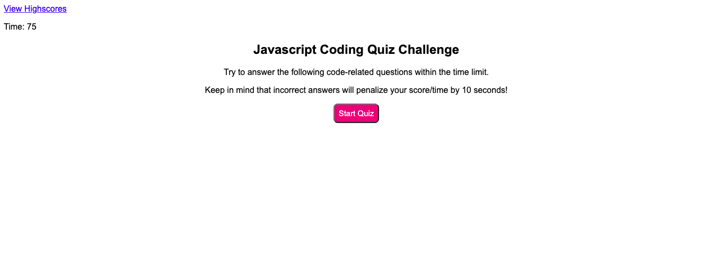
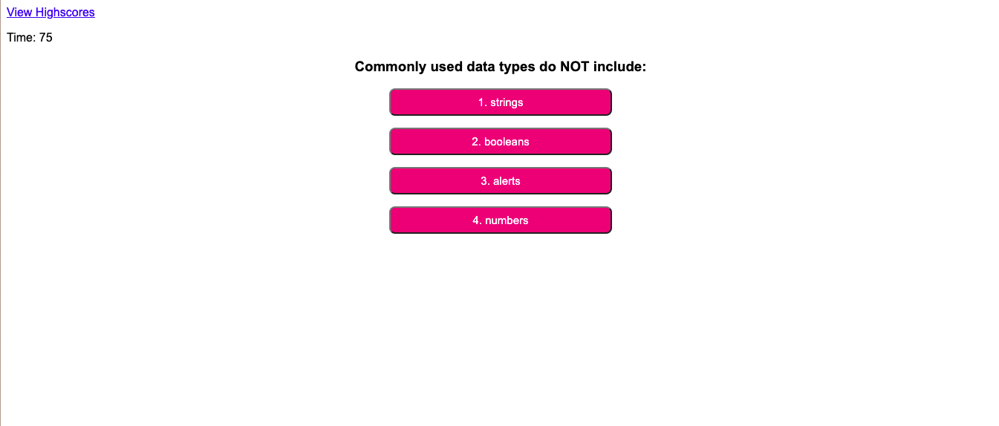

# coding-quiz
This is a timed javascript coding quiz. 

Upon clicking the start button, users should be presented with questions, and when they answer incorrectly, time is subtracted from the timer. When all questions or timer reaches 0, the game is over, and user should save their initials and score. 

This repository uses CSS, Javascript, and HTML. 

The github link for this repository is: https://github.com/ailict/coding-quiz

This website is deployed live at: https://ailict.github.io/coding-quiz/

